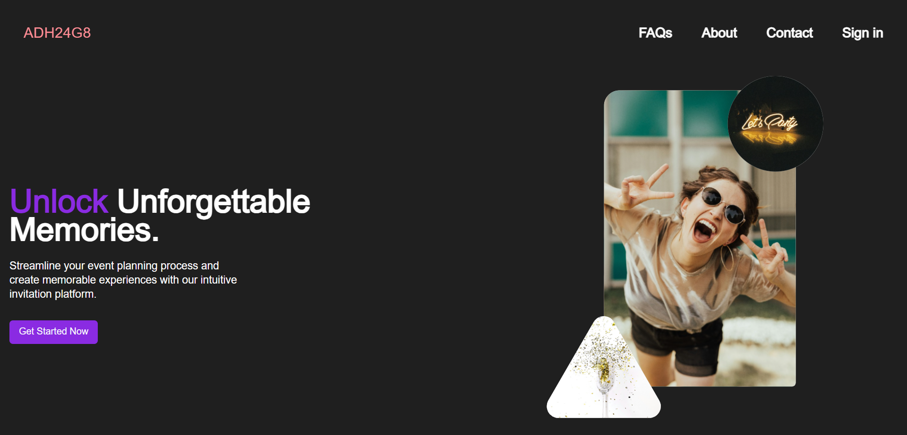

# ADH24GB 
 A platform that empowers users to register, host events, seamlessly share event links with friends, users, or communities, and effortlessly track attendance status.

 ## Core idea

 The idea is to create a website where users can sign up/ login to creat events, share event links with friends and family and track the event status.

 ## Features

- ⚡ [Next.js](https://nextjs.org) with App Router support
- 🔥 Type checking with [TypeScript](https://www.typescriptlang.org)
- 💎 Integrate with [Tailwind CSS](https://tailwindcss.com) styling
- ✅ Strict Mode for TypeScript, React 18 and Nextjs 14
- 🔒 Authentication with [Clerk](https://clerk.com?utm_source=github&utm_medium=sponsorship&utm_campaign=nextjs-boilerplate): Sign up, Sign in, Sign out, Forgot password and Reset password.
- 📏 Linter with [ESLint](https://eslint.org) (default Next.js, Next.js Core Web Vitals, Tailwind CSS and Airbnb configuration)

 ## Tech Stack

 Frontend

Backend 

 ## How to use

 * Clone the repository
 * Run npm install
 * Run npm run dev
